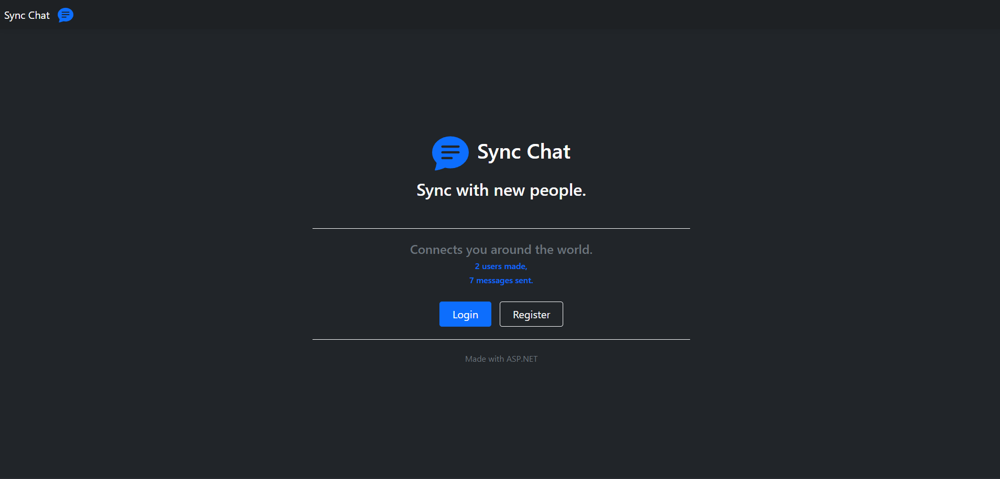
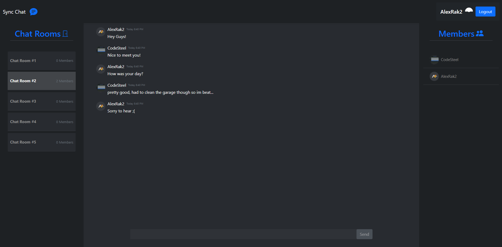
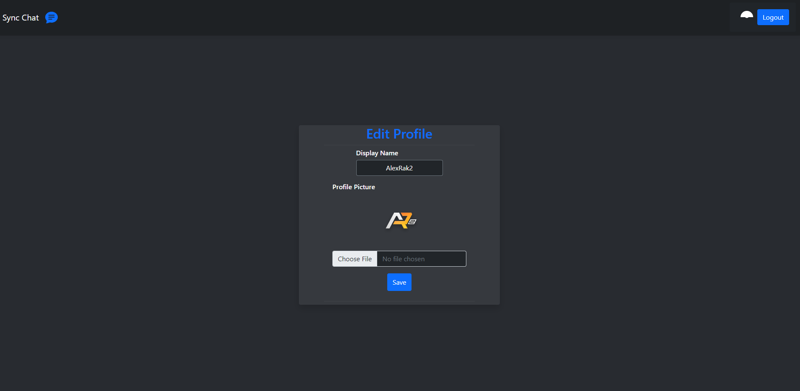

# Chat-Application

A real time chat app with multiple rooms to talk in made with ASP.NET using SignalR.

## Features

- **Authentication**: Register/Login manually or with Google
- **Join Room**: Join random chat rooms
- **Profile Pictures**: Customize your look
- **Profile Update**: Customize your profile
- **Join Room**: Join random chat rooms
- **Site Statistic**: Collecting site statistics EX: User count.

## Tech Stack

- **ASP.NET MVC**: Provides the backbone for the web app and API functionality.
- **MailerSend**: Used for handling all email services (e.g., verification and password resets).
- **Bootstrap**: Ensures responsive design for all forms and pages.
- **Google OAuth**: Used for secure, streamlined Google authentication.

## Screenshots

### Home

### Chat Room

### Profile

### Database

